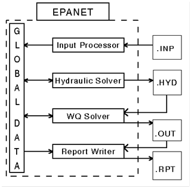
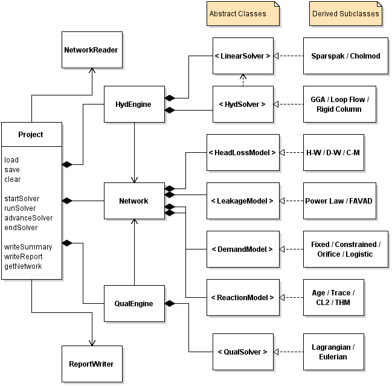
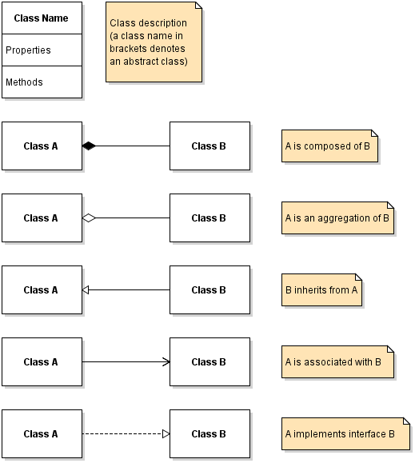
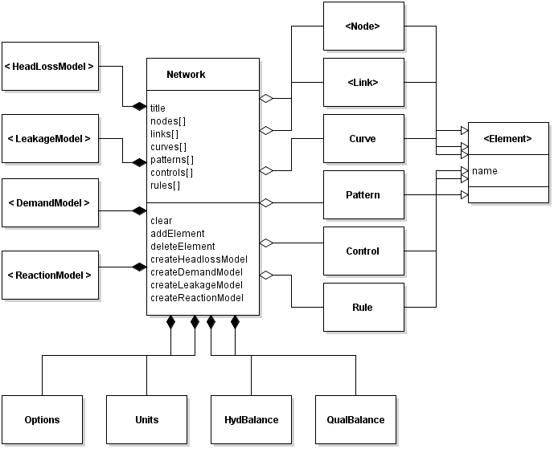
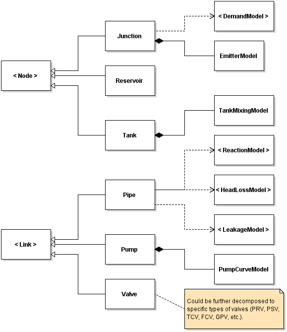
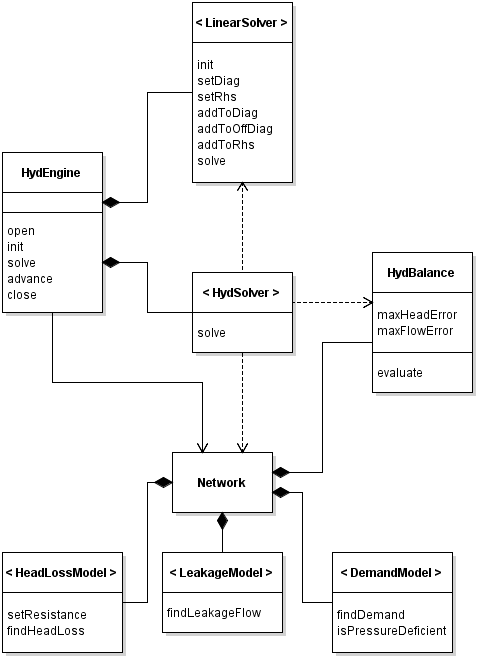
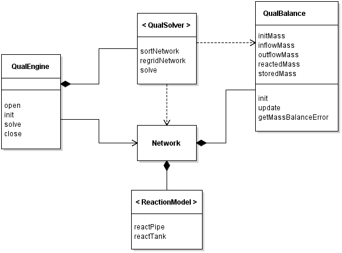
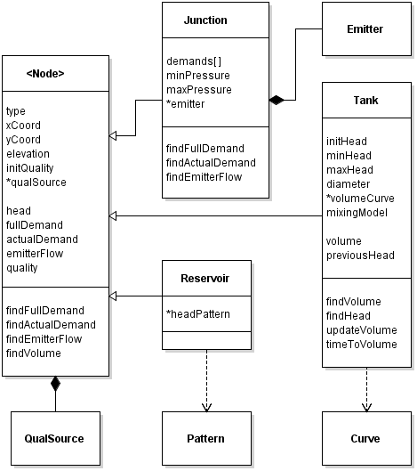
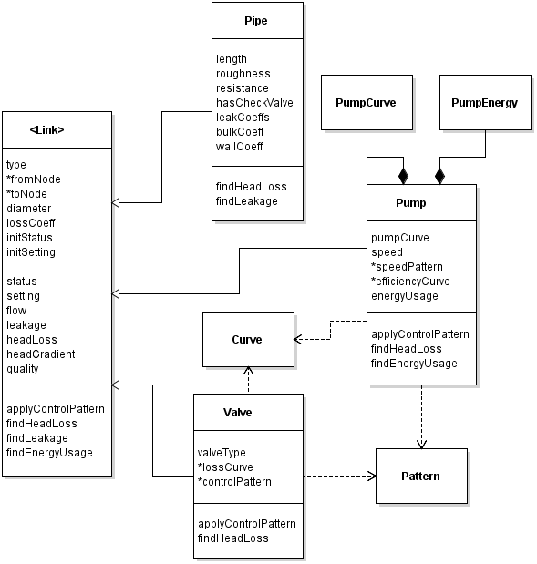

**A Proposed Design for EPANET 3**

**Introduction**

EPANET is a widely used computer program for simulating the hydraulic
and water quality behavior of water distribution networks. The current
design of its source code was essentially defined in the early 1990's
and is a good example of what is commonly known as procedural
programming -- a set of functions operating on a collection of separate
variables and data structures typically contained in a common (or
globally shared) memory space. Figure 1 is a representation of this
design.



***Figure 1. Design of the current EPANET engine (from Rossman, 1993).***

While this structure produces very efficient and compact code (the
compiled EPANET 2 engine is only 212 KB in size) its lack of modularity
and encapsulation make it difficult to modify existing features as well
as add new features and computational methods. Object-oriented
programming (OOP) is an alternative design approach that can overcome
these deficiencies. OOP arranges data and functions into logical
subgroups, making sure that data and functions which are related are
grouped together and that data and functions which are not related don't
interfere with each other. The more modular code that results is easier
to understand and modify.

What follows is a description of a proposed OOP design for the next
version of the computational engine of EPANET (aka EPANET 3). It has
been built with an eye towards modularity, extensibility,
maintainability and simplicity. This new engine could be packaged as a
C++ class library, a C-compatible function library, or as a stand-alone
command line executable. The proposed new design will be presented
through a series of UML class diagrams that would be implemented in the
C++ language.

**Overall Design**

Figure2 is a UML class diagram of the major components of the proposed
redesign of EPANET. (Refer to Figure 3 for an explanation of the
relationships displayed in a UML diagram.)Each box represents a
different class of object that is comprised of both attributes (data)
and methods (functions). The boxes in the column labeled Abstract
Classes define a functional interface that will be implemented by a
specific derived version of the class (i.e., a subclass) which is
created at runtime. Some examples of derived classes that could be
implemented for each abstract class are listed in the Derived Subclasses
column of boxes (to save space, several subclasses share the same box).
This ability of OOP to use derived classes adhering to a common
interface (known as polymorphism) makes it easier to add extensibility
into a program's design with minimal disruption to the rest of the code.



***Figure 2. An overall design for EPANET 3.***




***Figure 3. The relationships displayed in a UML diagram***
(https://vaughnvernon.co/?page\_id=31).

The **Project** class encapsulates an entire EPANET model and the
computational processes needed to analyze it. Providing this class as a
separate, all-encompassing entity allows multiple EPANET models to be
created and analyzed simultaneously in a thread-safe manner should a
user want to do so. The remaining classes in Figure 2 consist of a
network data base plus engines, solvers and models. The distinction
between the latter three entities is:

-   The **engine** classes (one for hydraulics and another for water
    quality) initialize an analysis, provide time-dependent "boundary
    conditions", and supply supervisory control to the project's solvers
    as an extended period simulation unfolds. The services they provide
    are the same no matter what choice of solvers and models is made.

-   The **solver** classes are software components that work within an
    engine to implement a specific algorithm for computing network
    hydraulics and water quality at a particular instance in time.

-   The **model** classes provide the solvers with alternative ways to
    represent and compute the behavior of specific elements on a
    network-wide basis. The examples shown in Figure 2 include pipe head
    loss, pipe leakage, pressure-dependent demands, and water quality
    reactions.

Table 1 lists some possible concrete subclasses of the abstract solver
and model classes that could be implemented. The ones with an asterisk
next to them already have their functionality included in the current
version of EPANET. This list is by no means exhaustive. Which group of
solvers and models will ultimately be included in EPANET 3 remains to be
seen. The point is that the polymorphic behavior of these classes will
make this task easier.

***Table 1. Candidate solvers and models for EPANET 3***

| **Name**              | **Description**       | **Source**            |
|-----------------------|:----------------------|:----------------------|
| *Hydraulic Solvers*   |                       |                       |
| Global Gradient Algorithm\*  | Solves for heads an flows in two stages at each Newton iteration. | Todini & Pilati, 1988 |
| Loop Flow Method      | Solves for change in loop flow at each Newton iteration. | Alvarruiz et al. (2015) | 
| Rigid Column Analysis | Solves time-dependent momentum equation in each pipe | Holloway et al. (1988) |
| *Sparse Linear Equation Solvers*  |           |                       |
| Sparspak\*            | Minimum Degree reordering + Cholesky factorization | George & Liu (1981) |
| Cholmod               | AMD reordering + Cholesky factorization | Davis (2008) |
| *Water Quality Solvers*  |                    |                       |
| Lagrangian Method\*   | Tracks movement of variable size water parcels through pipes | Rossman & Boulos (1996) |
| Eulerian Method       | Tracks water movement through fixed size pipe segments | Rossman et al. (1993) |
| *Computational Models* |                      |                       |
| Hazen-Williams Head Loss Model\* | HeadLoss = R(C)Flow^1.852 | Bhave (1991) |
| Darcy-Weisbach Head Loss Model\* | HeadLoss = R(ε)Flow^2 | Bhave 1991)  |
| Chezy-Manning Head Loss Model\* | HeadLoss = R(n)Flow^2  | Bhave (1991) |
| Power Law Leakage Model | Leakage = C1(Head)^C2   | Cassa & van Zyl (2014) 
| FAVAD Leakage Model   | Leakage = C1(Head)^0.5 + C2 (Head)^1.5 | Cassa & van Zyl (2014) |
| Fixed Demand Model\*  | Demand = Dfull        | Rossman (2000)        |
| Constrained Demand Model  | Negative pressure nodes converted to fixed grade | Todini (2006) |
| Power Demand Model    | Demand = min(Dfull, C1 (Pressure)^C2) | Wagner et al. (1988) |
| Logistic Demand Model | f = exp(C1 + C2 x Pressure) : Demand = Dfull * f / (1 + f) | Tanyimboh & Templeman (2010) |
| Water Age Quality Model\*  | Constant reaction rate equal to 1 | Rossman (2000) |
| Source Tracing Quality Model\* | Conservative tracer analysis  | Rossman (2000)  |
| 2-Zone Chlorine Decay Model\* | 1^st^ order bulk + wall Reaction | Rossman et al. (1994) |
| DBP Growth Model\*    | 1^st^ order saturation growth | Rossman (2000) |

*Functional equivalent currently implemented in EPANET 2.

**The Project Class**

The **Project** class is composed of a **Network** object, a
**HydEngine** object, and a **QualEngine** object. Its methods consist
of high-level tasks that a project can be called on to perform. These
include reading network data from an external source (such as an input
file), carrying out the individual steps of a simulation, and reporting
selected results from the simulation in a specific format. Listing 1
illustrates a function that uses the **Project** class to execute a
complete simulation.

```C++
void runEpanet(char* inpFile, char* rptFile) {
    Project project;                // Instantiate a Project object
    long t = 0;                     // Elapsed time = 0 seconds
    project.load(INPFILE, inpFile); // Read network data from an INP file
    project.startSolver();
    do {
        project.runSolver(t);       // Solve network at time t
        project.advanceSolver(t);   // Advance to next time period
    } while ( t > 0 );              // Stop if no more time remains
    project.endSolver();
    project.writeReport(rptFile);
}
 ```

***Listing 1. An example of using the **Project** class to run a complete
EPANET simulation***


**The Network Class**

The **Network** class is depicted in Figure 4. It contains collections
of the nodes and links that make up the physical layout of a pipe
network as well as the data elements used to describe its operation
(operating curves, demand/control patterns, simple link controls, and
complex rule-based controls). Each type of physical and informational
element is derived from an abstract base class named **Element** as
shown in the figure. In addition to these collections of network
elements the class also contains the following objects:



***Figure 4. A diagram of the **Network** class.***


-   An **Options** object that holds global default properties,
    simulation parameters, and time step values. This object also
    contains the choices the user has made for the types of solvers and
    models to be used by the project.

-   A **Units** object that handles conversions between the US and SI
    systems of units.

-   A **HydBalance** object that determines how well a particular
    solution for heads and flows satisfies the governing conservation of
    flow and energy equations.

-   A **QualBalance** object that keeps track of the water quality mass
    balance error as a simulation unfolds.

-   Derived implementations of the various abstract computational models
    discussed previously.

The public methods of the **Network** class contain procedures for
clearing a network of all data and for adding and deleting a specific
type of element. Not shown are a set of methods that return an
individual element (node, link, pattern, etc) from its collection
referenced either name or by index. A reference to the **Network**
object is frequently included in the methods implemented by the
project's engines so that the solvers and models used by these engines
have access to the project's data base.

There are also methods for creating particular instances of the models
used by a project's solvers. These are called by the project's
startSolver method. The way this works is illustrated in Listing 2 using
the **HeadLossModel** as an example.

```C++
// The Network object creates a particular type of pipe head loss model
// by calling the HeadLossModel class factory method.

void Network::createHeadLossModel()
{
    headLossModel = HeadLossModel::factory(options.headLossModel,                              
                                           options.viscosity);
    if ( headLossModel == nullptr )
        throw SystemError(SystemError::HEADLOSS_MODEL_NOT_OPENED);
}

// The HeadLossModel factory creates the particular type of model
// requested (H-W, D-W, or C-M).

HeadLossModel* HeadLossModel::factory(const string model, double viscos)
{
    if ( model == "H-W" ) return new HW_HeadLossModel();
    if ( model == "D-W" ) return new DW_HeadLossModel(viscos);
    if ( model == "C-M" ) return new CM_HeadLossModel();
    return nullptr;
}

// A Pipe object will use the Network’s generic headLossModel object
// to compute its head loss and gradient for a given flow rate q, 
// without having to know whether it’s a H-W, D-W, or C-M model.

void Pipe::findHeadLoss(Network* network, double q)
{
    network->headLossModel->findHeadLoss(this, q, headLoss, headGradient);
}
```

***Listing 2. Implementing the abstract HeadLossModel class interface.***

Figure 5 further breaks down the abstract **Node** and **Link** classes
into their subclasses -- **Junction**, **Tank** and **Reservoir** for
nodes and **Pipe**, **Pump** and **Valve** for links. It also shows the
models that each of these subclasses uses to describe some aspect of its
behavior. Some of these are the models previously discussed, wherein a
single instance of the model is used on a network-wide basis (e.g. the
pipe **HeadLossModel**). Others are element-specific models, such as the
**PumpCurveModel**, where a different variation of the model (e.g., a
power function curve, a user-supplied curve, or a constant horsepower
curve) could be used for different pump objects. A more detailed
description of the properties and methods of the **Node** and **Link**
classes are presented in the Appendix.



***Figure 5. Breakdown of the **Node** and **Link** classes***


**The Engine Classes**

Figure 6 depicts the **HydEngine** class and the objects it interacts
with. This class performs the following functions:

-   It creates specific instances of the **LinearSolver** and
    **HydSolver** subclasses using the choices contained in the
    network's **Options** object.

-   It asks the **Network** object to create specific instances of the
    head loss, pipe leakage and pressure-dependent models to be used in
    an analysis, again using choices contained in the network's
    **Options** object.

-   It initializes the state of the pipe network prior to the start of
    an analysis.

-   When the Project::runSolver() method is invoked for a particular
    time period, it updates all demands, executes all control actions
    and calls on its **HydSolver** object to solve for network
    hydraulics.

-   When the Project::advanceSolver() method is invoked, it advances the
    simulation clock to the next time that the hydraulic state of the
    network needs to be updated.



***Figure 6. A diagram of the **HydEngine** class***


The **HydSolver** object receives a reference to the project's
**Network** object when it is first created and thus has access to all
of the latter's data and models. It also receives a reference to the
**HydEngine**'s **LinearSolver** object should it need to solve a
linearized representation of the network's hydraulic equations, such as
when the solver is of the Newton-Raphson variety. It can also call upon
a **HydBalance** object to determine how well a particular trial
solution for heads and flows satisfies the governing conservation of
flow and energy equations.


Figure 7 depicts the **QualEngine** class and the objects it interacts
with. This class performs the following actions:



***Figure 7. Diagram of the **QualEngine** class.***


-   It creates a specific instance of the **QualSolver** class using the
    choice contained in the network's **Options** object.

-   It asks the **Network** object to create a specific type of
    **ReactionModel** to be used in an analysis, again using the choice
    contained in the network's **Options** object.

-   It initializes the water quality state of the network prior to the
    start of an analysis.

-   When the water quality state of the network needs updating it:

    -   Topologically sorts the network's links if flow directions have
        changed.

    -   Asks its **QualSolver** object to re-grid the network's pipes
        should it need to do so.

    -   Determines the magnitude of any externally imposed water quality
        sources.

    -   Calls on its **QualSolver** object to update the water quality
        state of the network.


In similar fashion to the **HydSolver**, the **QualSolver** object
receives a reference to the project's **Network** object when it is
first created thus giving it access to all of the network's data
elements and its reaction model. It can also call upon a **QualBalance**
object to determine how large a mass balance error is being produced as
the simulation unfolds.

**Summary and Conclusions**

An object oriented structure for the next version of the EPANET
simulation engine has been developed. A single project class contains a
network's data base and the engines needed to analyze it. The engines
call upon a set of solvers to implement specific hydraulic and water
quality solution algorithms. The solvers utilize sets of interchangeable
models to compute the behavior of individual network elements.

The EPANET 3 structure utilizes several standard software design
patterns that are known to improve maintainability, re-usability and
quality (Shalloway and Trott, 2005). The **HydEngine** and
**QualEngine** classes are examples of the **Facade Pattern** that
decouples the complexities of the solver and model class subsystems from
the **Project** class. The various solver and model classes illustrate
the use of the **Strategy Pattern**. This pattern defines a family of
algorithms, encapsulates each one, and makes them interchangeable. It
lets the algorithm vary independently from clients that use it. Finally,
each family of algorithms belonging to a solver or model class use the
**Abstract Factory Pattern** to create a particular member of that
family at runtime.

The stated goals for the new EPANET 3 design were modularity,
extensibility, maintainability, and simplicity. How these goals have
been met will now be discussed.

**Modularity** has been achieved by building the design from a group of
individual objects that have a set of well defined properties and
functionality. Table 2 lists the major classes of objects that make up
the new design. Each class of object can be considered a self-contained
component that has limited exposure and interaction with other classes.
Classes can be physically insulated from one another by placing their
code in separate files which also makes it easier to identify where
specific pieces of the program's source code are located.

***Table2. Major classes of objects in EPANET 3's proposed structure***

| Class        | Abstract | Purpose                      |
| -----        |:---------|:-----------------------------|
| Project | | Encapsulates a network database and its solvers and models
| ***Input / Output*** | | 
| NetworkReader | x |Reads network data from an external source
| ReportWriter | | Writes simulation results to a formatted text file
| ***Hydraulic Analysis*** |  |
| HydEngine | | Supervises the sequence of tasks needed to solve network hydraulics
| HydBalance | |	Evaluates the error in meeting conservation of flow and energy 
| HydSolver| x | Solves network hydraulics at a given point in time
| LinearSolver| x | Solves a sparse system of linear equations
| ***Water Quality Analysis*** | |
| QualEngine | |	Supervises the tasks needed to update network water quality
| QualBalance | | Evaluates the error in meeting conservation of water quality mass
| QualSolver | x | Updates water quality within the network over a time step
| ***Network Database*** | |
| Network | | Contains collections all network elements
| Options | | Contains simulation options and choices for solvers and models
| Units | | Handles unit conversions between US and SI units
| Element | x | The parent of all network data elements
| Node | x | Represents the properties of either a Junction, Reservoir or Tank
| Link | x | Represents the properties of either a Pipe, Pump, or Valve
| Pattern |  | Represents how a quantity changes over increments of time
| Curve |  | Represents a tabular relationship between two quantities.
| Control | | A statement that controls a link based on a single condition
| Rule |  | A group of if-then-else conditions that control one or more links
| ***Modeling Components*** | |
| HeadLossModel | x | Computes head loss and its gradient within a pipe
| LeakageModel | x | Computes pipe leakage as a function of pressure
| DemandModel |x | Computes nodal demand as a function of pressure
| ReactionModel | x | Computes water quality change due to reaction
| Emitter | | Computes flow leaving a node as a function of pressure
| QualSource | | Characterizes the properties of an external water quality source
| PumpCurve | | Characterizes the relation between flow and head for a pump
| PumpEnergy | | Computes the energy usage and its cost for a pump
| TankMixing | | Models the mixing regime within a storage tank
| ***Supporting Classes*** | |
| RuleManager | | Handles the implementation of rule-based controls
| Diagnostics | | Checks for valid network data and connectivity
| Topology | | Sorts links topologically and determines node adjacency lists


**Extensibility** is built into the proposed design by utilizing the OOP
concept of sub-classing abstract classes to achieve polymorphism. For
example, to add a new pipe leakage model named **NewLeakageModel** to
the family of available leakage models one would perform the following
steps:

1.  Create a new class named **NewLeakageModel** that inherits from
    **LeakageModel**.

2.  Add a method to this class named findLeakageFlow that has the same
    signature (input and output parameters) as declared in the parent
    **LeakageModel** class.

3.  In the factory method of the **LeakageModel** class add a line of
    code that reads:

    ```if (model == "NewLeakageModel") return new NewLeakageModel();```

    New solvers for hydraulics, water quality and linear equations could
    be added in a similar fashion.

**Maintainability** has been defined as the ease with which software can
be modified to correct faults, make improvements, and adapt to a changed
environment (ISO/IEC, 2001). The modular design of EPANET 3, which
breaks the code into distinct and separate classes that have
well-defined but limited linkages to one another, can facilitate
maintaining a high quality code base. Maintainability suffers when there
is excessive coupling between classes. Coupling occurs when one class is
affected by changes or defects in another class. In the class diagrams
this type of dependency is represented by a dashed line with an open
arrow. Methods are available to help insulate classes from one another
(see Lakos, 1996) but they come at a cost of increasing code complexity.

**Simplicity** in software design usually means that a program's
structure and function are easy to understand and to reason about.
Simply structured code makes it easier to achieve extensibility and
maintainability. The proposed EPANET 3 design can be considered simple
in the sense that it:

1.  composes an EPANET project out of just three principal classes
    (Network, HydEngine, and QualEngine),

2.  has these classes utilize families of abstract classes to perform
    various functions, where the concrete implementations of these
    classes can contain as much complexity as need be as long as they
    adhere to a common published interface for each family,

3.  spreads the program's functionality among a set of decoupled objects
    that are each used to perform a limited set of tasks (see Table 2).

In conclusion, the OOP design for EPANET outlined here presents a
logical and effective structure upon which the next version of the
software can be built.

**References**

Alvarruiz, F., Martínez-Alzamora, F. and Vidal, A.M. (2015). "Improving
the Efficiency of the Loop Method for the Simulation of Water
Distribution Systems", *J. Water Resour. Plann. Manage*., 141(10).

Anjos, E.G. (2017). *Assessing Maintainability in Software
Architectures*, Ph.D. Thesis, University of Coimbra, Portugal.

Bhave, P.R. (1991). *Analysis of Flow in Water Distribution Networks*,
Technomic Publishing, Lancaster, PA.

Davis, T.A. (2008). *User* *Guide for CHOLMOD: a sparse Cholesky
factorization and modification package*, Dept. of Computer and
Information Science and Engineering, Univ. of Florida, Gainesville, FL
http://www.cise.ufl.edu/research/sparse

George, A. and Liu, J.W. (1981). Computer *Solution of Large Sparse
Positive Definite Systems*, Prentice-Hall, Englewood Cliffs, NJ.

Holloaway, M.B., Chaudhry, M.H. and Karney, B.W. (1988). "Modeling of
unsteady flow in pipe networks", *Int. Symp. Comp. Modeling of Water
Distribution Sys.,* Lexington, KY, 311-322.

ISO/IEC (2001). *Software Engineering--Product Quality: Quality model.
Vol. 1*, International Organization for Standardization.

Lakos, J. (1996). *Large-Scale C++ Software Design*, Addison-Wesley,
Boston, MA.

Rossman, L.A. (1993). "The EPANET Water Quality Model*", Integrated
Computer Applications in Water Supply, Vol. 2*, B. Coulbeck (editor),
Research Studies Press, England, 79-94.

Rossman, L.A. (2000). *EPANET 2 Users Manual*, EPA/600/R-00/057, U.S.
Environmental Protection Agency, Cincinnati, OH.

Rossman, L.A., Clark, R.M., and Grayman, W.M. (1994). "Modeling chlorine
residuals in drinking-water distribution systems", *Jour. Env. Eng*.,
120(4): 803-820.

Rossman, L.A., Boulos, P.F., and Altman, T. (1993). "Discrete
volume-element method for network water-quality models*", J. Water
Resour. Plng. and Mgmt*, 119(5):505-517.

Rossman, L.A. and Boulos, P.F. (1996). "Numerical methods for modeling
water quality in distribution systems: A comparison", *J. Water Resour.
Plng. and Mgmt*, 122(2):137-146.

Tanyimboh, T.T. and Templeman, A.B. (2010) "Seamless pressure-deficient
water distribution system model", *J. Water Management*, ICE,
163(8):389-396.

Shalloway, A. and Trott, J.R. (2005). *Design Patterns Explained*, 2^nd^
Edition, Addison-Wesley, Boston, MA.

Todini, E. (2006). "Towards Realistic Extended Period Simulations (EPS)
in Looped Pipe Networks", *Proceedings of the 8th Annual Water
Distribution Systems Analysis Symposium, WDSA2006 ,* Cincinnati, OH.

Todini, E. and Pilati, S. (1988) "A gradient algorithm for the analysis
of pipe networks", *Computer Applications in Water Supply, Volume 1,*
Coulbeck, B., and Orr, C-H (eds.), Research Studies Press, England.

Wagner, J.M., Shamir, U., and Marks, D.H. (1988). "Water distribution
reliability: simulation methods", *J. Water Res. Plan. Manage*.,
114(3):276-294.

**Appendix**

**Node and Link Classes**

The structures of the abstract **Node** and **Link** classes are
displayed in Figures 8 and 9, respectively. When a **Network** invokes
its createElement method, the element created will be a particular
instance of either a **Node** subclass (a **Junction**, **Tank**, or
**Reservoir**) or a **Link** subclass (a **Pipe**, **Pump** or
**Valve**) that inherits the properties of it parent.



***Figure 8. A diagram of the **Node** class.***

Nodes all have a type, a set of X,Y coordinates, an elevation, a head, a
water quality value, etc. But only **Junction** nodes have demands and
only **Tank** nodes have a volume. The default behavior for a node's
findFullDemand, findActualDemand, and findEmitterFlow methods is to
return 0. These methods are overridden by a **Junction** node as it is
the only type of node that can have demand and emitter flows. Likewise,
a node's findVolume method is defined to return 0 when called by a
**Junction** or **Reservoir**, but will be overridden by a **Tank's**
method of the same name (which will use the tank's volume curve to
determine the volume at a given head).



***Figure 9. A diagram of the **Link** class.***

All **Links** have pointers to their end nodes, a diameter, a control
setting/status, a flow rate, a water quality value, etc. But only
**Pipes** have a length, roughness, and leakage coefficients and only
**Pumps** have a pump curve, an efficiency curve, and a speed setting.
All **Links** have a findHeadLoss method, but it is implemented
differently by **Pipes** (which use the network's **HeadLossModel**), by
**Pumps** (which use the **PumpCurve** object) and by **Valves** (which
uses its own private methods).
